# G431FOC

**STM32G431CBT6 PMSM 永磁同步电机 FOC 驱动工程**

基于 STM32G431CBT6 实现永磁同步电机的磁场定向控制（FOC）：MT6701 磁编码器（SPI + DMA）、两相低侧电流采样与零偏校准、Clarke/Park 变换、SVPWM、互补 PWM、电流/速度/位置三环串级控制，以及简化 MIT 阻抗控制。

> 控制算法代码为独立实现，底层 HAL/CMSIS-DSP 使用 ST/ARM 官方库。

---

## 效果展示

### 电流环 Iq/Id 跟踪

<p align="center">
  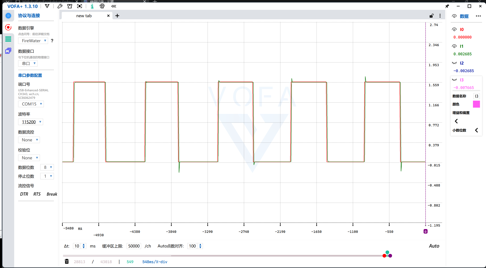
</p>

### 位置 / 速度 / 电流三环跟踪

<p align="center">
  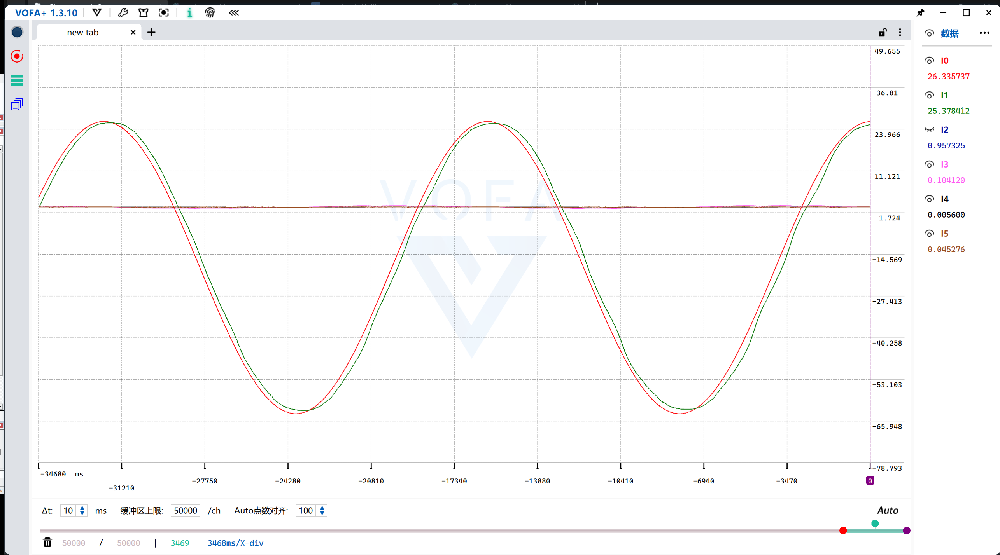
</p>

### ADC / SPI 时序修复前后

<p align="center">
  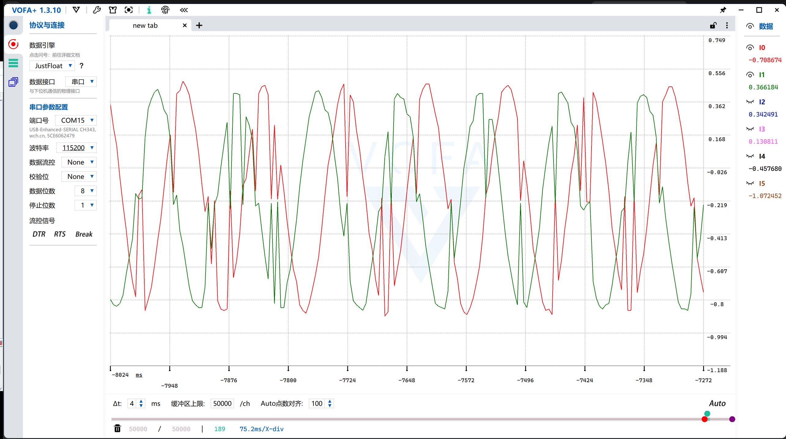
  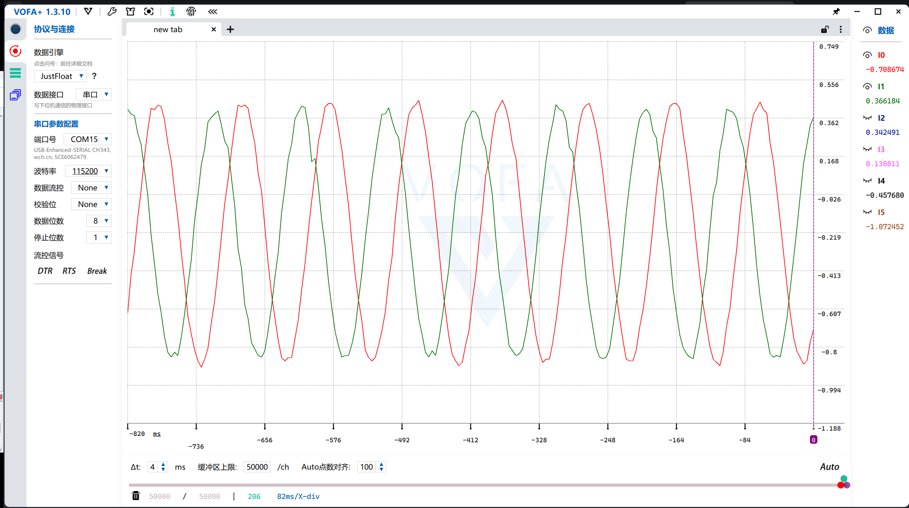
</p>

### 速度纹波与磁铁偏心优化

<p align="center">
  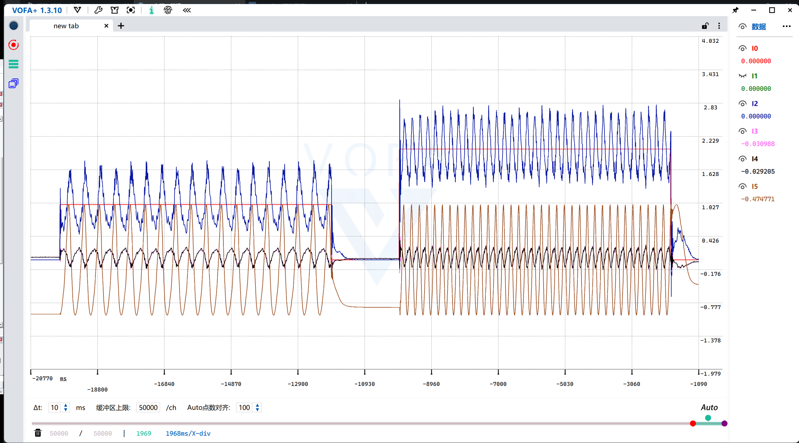
</p>

<p align="center">
  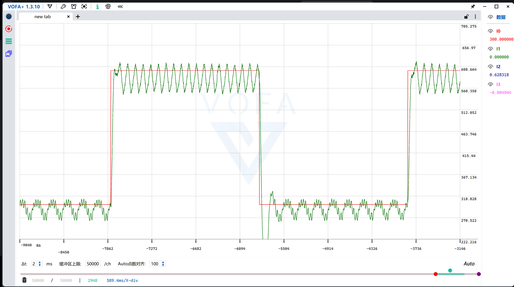
  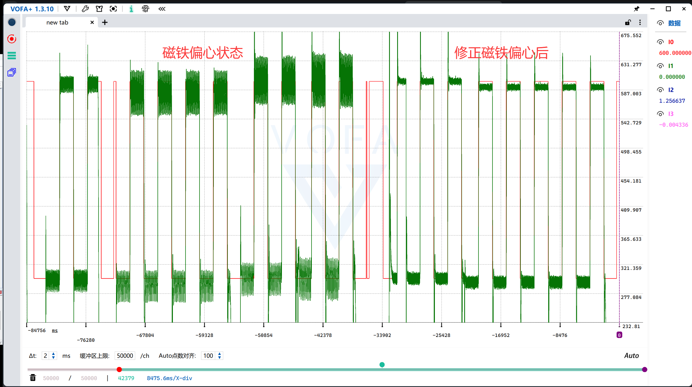
  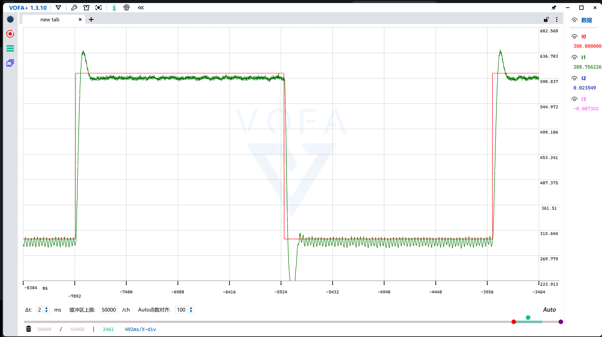
</p>

### 电流环饱和与抗饱和

<p align="center">
  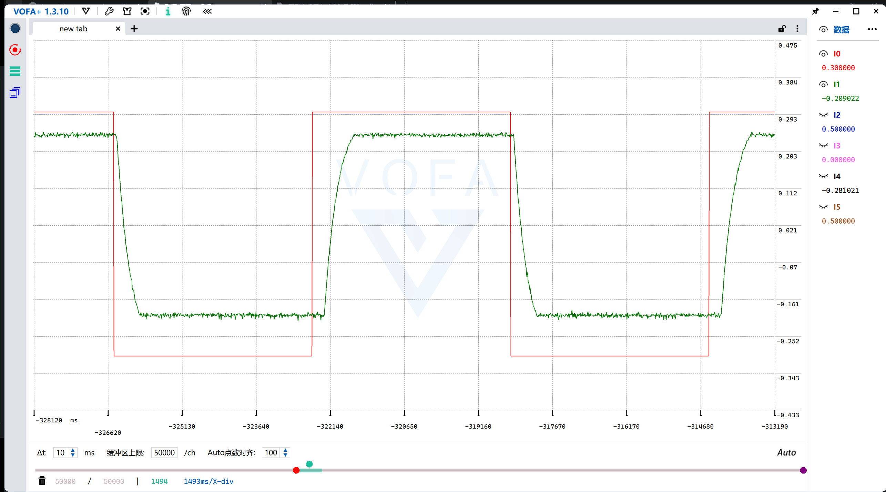
  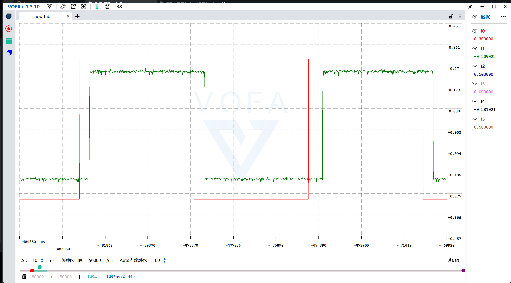
</p>

### 硬件与运行

<p align="center">
  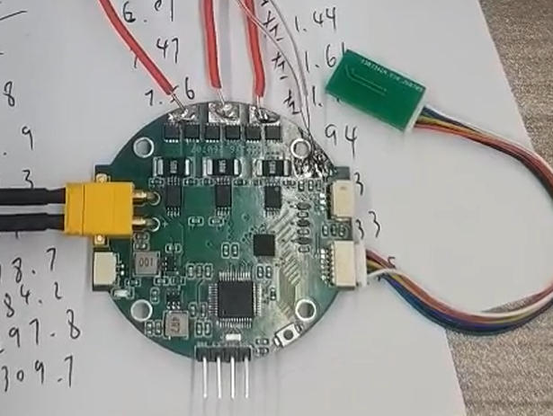
</p>

<p align="center">
  <video src="media/motor_run.mp4" width="60%" controls></video>
</p>

---

## 硬件

| 项目 | 型号/参数 |
| --- | --- |
| MCU | STM32G431CBT6, 170 MHz |
| 编码器 | MT6701：电机端 SPI3，减速器端 SPI1 |
| 电流采样 | INA240A1PWR（20 V/V），两相低侧采样 |
| 采样电阻 | 5 mΩ |
| 栅极驱动 | FD6288Q |
| 功率管 | WSD4070DN |

## 控制环

| 环路 | 频率 |
| --- | --- |
| 电流环 | 20 kHz |
| 速度 / MIT 环 | 1 kHz |
| 位置环 | 100 Hz |

ADC 注入组由中心对齐 PWM 触发。中心对齐模式下每个 PWM 周期会产生两次更新事件，软件只接受其中一个 TIM 计数方向，因此有效电流环为 20 kHz，而 ADC 原始回调约为 40 kHz。

## 工程结构

```text
Core/         应用初始化、中断服务、HAL 配置
HARDWARE/     FOC 应用模块
Drivers/      ST HAL 与 CMSIS
Middlewares/  ARM CMSIS-DSP
MDK-ARM/      Keil 工程
media/        波形、照片与演示视频
G431FOC.ioc   STM32CubeMX 配置
```

## 核心模块

| 文件 | 职责 |
| --- | --- |
| `HARDWARE/angle_encoder.c` | MT6701 SPI+DMA、跨圈累计、电角度 |
| `HARDWARE/current_sense.c` | 注入 ADC、零偏校准、Clarke/Park、电流环 |
| `HARDWARE/svpwm_driver.c` | SVPWM 合成与 TIM1 通道映射 |
| `HARDWARE/pid_regulator.c` | 位置式 PID 与 MIT/PD 控制器 |
| `HARDWARE/motor_controller.c` | 1 kHz 速度 / MIT / 位置调度 |
| `HARDWARE/foc_app.c` | 初始化、开环对齐、测试目标、遥测 |
| `HARDWARE/telemetry.c` | VOFA+ JustFloat 输出 |

## 构建

使用 Keil 打开：

```text
MDK-ARM/G431FOC.uvprojx
```

或用 STM32CubeMX 打开 `G431FOC.ioc` 查看外设配置。

## 测试模式

通过修改 `HARDWARE/foc_app.c` 中的 `FOC_APP_MODE` 选择测试目标：

```c
FOC_MODE_CURRENT                    // Iq 阶跃跟踪
FOC_MODE_SPEED_CURRENT              // 速度-电流串环，正弦目标
FOC_MODE_POSITION_SPEED_CURRENT     // 位置-速度-电流三环
FOC_MODE_MIT                        // 简化 MIT 阻抗控制
```

> 电机驱动固件。上电前请确认电源、相序、电流上限、编码器方向与机械固定。
